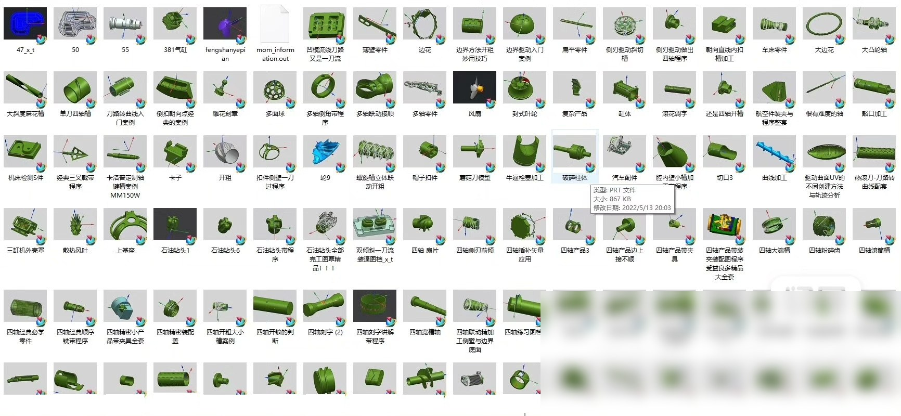

# UG NX is a powerful CAD/CAM software that allows users to create 3D models design parts and generate toolpaths for CNC machines. It has become an essential tool in the manufacturing industry for its flexibility and efficiency. In this response we will provide you with some useful UG NX programming materials such as 500 examples of multi-axis programming including bird's nest impeller etc.

1. **Bird's Nest**
- **Step 1:** Design the basic shape of the bird's nest.
- **Step 2:** Add details like branches, leaves, and beaks using solid modeling tools.
- **Step 3:** Use the Boolean operation to combine shapes and remove unnecessary parts.
- **Step 4:** Apply surface modification techniques to add texture and depth.
- **Step 5:** Create a hole for the bird's nest to be attached to a support structure.
- **Step 6:** Generate toolpaths for milling or turning operations.

2. **Impeller**
- **Step 1:** Design the basic shape of the impeller.
- **Step 2:** Add details like blades, hub, and shaft using solid modeling tools.
- **Step 3:** Use the Boolean operation to combine shapes and remove unnecessary parts.
- **Step 4:** Apply surface modification techniques to add texture and depth.
- **Step 5:** Create a hole for the impeller to be attached to a motor.
- **Step 6:** Generate toolpaths for machining operations.

3. **Multi-Axis Programming Examples**
- **Example 1:** A gearbox assembly.
- **Step 1:** Design the basic shape of the gearbox.
- **Step 2:** Add details like teeth, bearings, and shafts using solid modeling tools.
- **Step 3:** Use the Boolean operation to combine shapes and remove unnecessary parts.
- **Step 4:** Apply surface modification techniques to add texture and depth.
- **Step 5:** Create a hole for the gearbox to be attached to a motor.
- **Step 6:** Generate toolpaths for machining operations.

- **Example 2:** A screw assembly.
- **Step 1:** Design the basic shape of the screw.
- **Step 2:** Add details like threads, head, and shank using solid modeling tools.
- **Step 3:** Use the Boolean operation to combine shapes and remove unnecessary parts.
- **Step 4:** Apply surface modification techniques to add texture and depth.
- **Step 5:** Create a hole for the screw to be attached to a base.
- **Step 6:** Generate toolpaths for turning operations.

In summary, these are just some examples of how to use UG NX for multi-axis programming. The key is to understand the basic principles of solid modeling and then apply them to create complex parts with accurate dimensions and detailed features.

# Body

UG NX is a powerful CAD/CAM software that allows users to create 3D models, design parts, and generate toolpaths for CNC machines. It has become an essential tool in the manufacturing industry for its flexibility and efficiency. In this response, we will provide you with some useful UG NX programming materials such as 500 examples of multi-axis programming, including bird's nest, impeller, etc.

1. **Bird's Nest**
- **Step 1:** Design the basic shape of the bird's nest.
- **Step 2:** Add details like branches, leaves, and beaks using solid modeling tools.
- **Step 3:** Use the Boolean operation to combine shapes and remove unnecessary parts.
- **Step 4:** Apply surface modification techniques to add texture and depth.
- **Step 5:** Create a hole for the bird's nest to be attached to a support structure.
- **Step 6:** Generate toolpaths for milling or turning operations.

2. **Impeller**
- **Step 1:** Design the basic shape of the impeller.
- **Step 2:** Add details like blades, hub, and shaft using solid modeling tools.
- **Step 3:** Use the Boolean operation to combine shapes and remove unnecessary parts.
- **Step 4:** Apply surface modification techniques to add texture and depth.
- **Step 5:** Create a hole for the impeller to be attached to a motor.
- **Step 6:** Generate toolpaths for machining operations.

3. **Multi-Axis Programming Examples**
- **Example 1:** A gearbox assembly.
- **Step 1:** Design the basic shape of the gearbox.
- **Step 2:** Add details like teeth, bearings, and shafts using solid modeling tools.
- **Step 3:** Use the Boolean operation to combine shapes and remove unnecessary parts.
- **Step 4:** Apply surface modification techniques to add texture and depth.
- **Step 5:** Create a hole for the gearbox to be attached to a motor.
- **Step 6:** Generate toolpaths for machining operations.

- **Example 2:** A screw assembly.
- **Step 1:** Design the basic shape of the screw.
- **Step 2:** Add details like threads, head, and shank using solid modeling tools.
- **Step 3:** Use the Boolean operation to combine shapes and remove unnecessary parts.
- **Step 4:** Apply surface modification techniques to add texture and depth.
- **Step 5:** Create a hole for the screw to be attached to a base.
- **Step 6:** Generate toolpaths for turning operations.

In summary, these are just some examples of how to use UG NX for multi-axis programming. The key is to understand the basic principles of solid modeling and then apply them to create complex parts with accurate dimensions and detailed features.

# Images

# Payment

Here is a pay link on Stripe ( https://buy.stripe.com/3cs8yP7sY87d0vu9AB ). Please contact me lonlonago@foxmail.com after funding $89, and I will send you a complete data files , thank you

Computer vision/deep learning algorithm services primarily focus on areas such as object detection, image segmentation, multimodal analysis, defect detection, face recognition, OCR, medical image analysis, autonomous driving perception, video understanding, behavior recognition, point cloud processing, image enhancement and restoration, image retrieval, and motion prediction.
Communication can be conducted based on specific tasks: model replication, algorithm optimization, performance improvement, model modification, code interpretation/code analysis, data processing, environment configuration, parameter tuning, experimental design, and result analysis, etc.
Core direction overview:
1. Object detection/tracking
Object detection, salient object detection, keypoint detection, lane line detection, point cloud object detection, point cloud segmentation, object tracking, motion detection, motion prediction.
2. Image segmentation/reconstruction
Image segmentation, semantic segmentation, medical image segmentation, geographic information segmentation, remote sensing data segmentation, 3D reconstruction, super-resolution reconstruction, point matching.
3. Face recognition/OCR/Industrial inspection
Face recognition, face detection, mask detection, license plate recognition, text recognition, OCR, defect detection, industrial inspection, anomaly detection.
4. Video understanding/behavior recognition
Video understanding, behavior recognition, pose estimation, gesture recognition, fight recognition, depth estimation, and autonomous driving perception.
5. Image enhancement/restoration
Image dehazing, image deraining, denoising, defogging, image restoration, and image compression.
6. Multimodal/large model related
The directions of multimodal, large model fine-tuning, algorithm analysis, and joint image-text representation are communicable.
Technology stack:
Inference frameworks: TensorRT, ONNX, OpenVINO
Common models/directions: YOLO, GAN, VIT, SLAM, diffusion models, etc. Discussions can be held based on project requirements.
Application fields:
For applications such as street view, medicine, remote sensing, daily scenes, industrial inspection, autonomous driving, and biomedical imaging, we can first discuss the specific requirements.
Individual work, suitable for developers with experience in computer vision, deep learning, algorithm replication, model optimization, code development, and project requirements.
The price is determined based on the difficulty and workload of the project.
Individual order receiving, quality guaranteed, after-sales service guaranteed. Welcome to directly send a private message to specify the specific task. We can communicate according to the specific task: model replication, algorithm optimization, performance improvement, model modification, code interpretation/code analysis, data processing, environment configuration, parameter tuning, experimental design and result analysis, etc.
Contact information: lonlonago@foxmail.com

